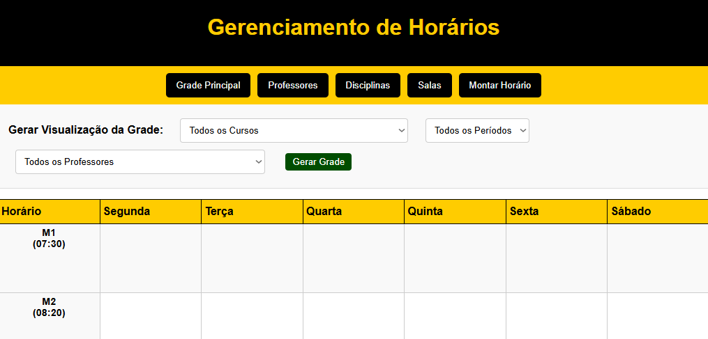
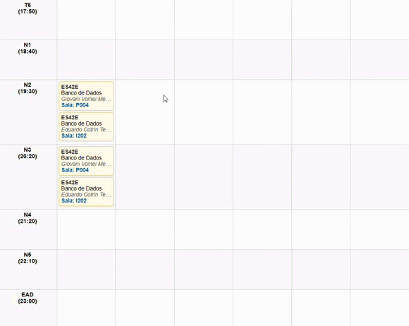

# Sistema de Gerenciamento de Horários Acadêmicos

Um SPA (Single Page Application) de front-end para gerenciamento interativo de grades de horários acadêmicos, focado na manipulação visual (arrastar e soltar) e na detecção de conflitos em tempo real.


## 🚀 Visão Geral e Demonstração

A aplicação renderiza uma grade de horários interativa (dias da semana vs. horários), permitindo que os usuários aloquem aulas visualmente. O sistema valida automaticamente conflitos de professores, salas e turmas.

### Figura 1: Grade Principal e Detecção de Conflitos



*A interface principal exibe todas as aulas alocadas. Células em vermelho indicam conflitos de alocação (professor ou sala já em uso), e células em laranja indicam conflitos de grade (mesma turma com duas aulas simultâneas).*

### Figura 2: Interação (Arrastar e Soltar & Copiar/Colar)



*As aulas podem ser movidas (Drag & Drop) ou duplicadas (usando Ctrl+C e Ctrl+V). O sistema valida conflitos em todas as operações.*

## ✨ Principais Funcionalidades

### Manipulação Visual

- **Arrastar e Soltar (Drag & Drop)**: Mova aulas facilmente entre horários e dias
- **Copiar, Colar e Excluir**: Atalhos de teclado (`Ctrl+C`, `Ctrl+V`, `Delete`) para gerenciamento rápido

### Detecção de Conflitos em Tempo Real

- **Conflito de Alocação (Vermelho)**: Impede que um professor ou sala seja alocado em dois lugares ao mesmo tempo
- **Conflito de Grade (Laranja)**: Impede que uma turma (mesmo curso/período) tenha duas disciplinas simultâneas

### Outras Funcionalidades

- **Filtragem Dinâmica**: Filtre a visualização da grade principal por Curso, Período ou Professor
- **Gerenciamento CRUD**: Seções dedicadas para adicionar, visualizar e excluir:
  - Professores
  - Disciplinas
  - Salas
- **Notificações (Toast)**: Feedback visual para ações de sucesso, erro ou aviso de conflito

## 🛠️ Tecnologias Utilizadas

Este projeto é construído exclusivamente com tecnologias web fundamentais, sem a necessidade de frameworks de front-end.

- **HTML5**: Estrutura semântica da aplicação
- **CSS3**: Estilização (incluindo Flexbox), animações e destaques de interação/conflito
- **JavaScript (ES6+)**: Lógica da aplicação, manipulação do DOM, gerenciamento de estado, eventos (drag, drop, keyboard) e comunicação com a API (via `fetch`)

## 📂 Estrutura do Projeto

Esta estrutura de projeto assume um backend Node.js (`server.js`) que serve os arquivos estáticos da pasta `/public` e gerencia os dados (provavelmente lendo/escrevendo os arquivos JSON na pasta `/data`).

```
.
├── 📁 data/
│   ├── 📄 cursos.json
│   ├── 📄 departamentos.json
│   ├── 📄 disciplinas.json
│   ├── 📄 horarios.json
│   ├── 📄 professores.json
│   └── 📄 salas.json
├── 📁 public/
│   ├── 📄 index.html    # Ponto de entrada (SPA)
│   ├── 🎨 style.css     # Folha de estilos
│   └── ⚙️ app.js        # Lógica do front-end
└── 🚀 server.js         # Servidor backend (Ex: Node.js/Express)
```

## 🔌 Requisitos de Backend (API)

Este é um projeto puramente front-end e **não funcionará sem um servidor de backend** que responda às rotas de API esperadas. O `app.js` está configurado para se comunicar com um servidor na mesma origem, sob o prefixo `/api/`.

### Responsabilidades do Backend

O backend (`server.js`) é responsável por:

- Servir os arquivos estáticos da pasta `/public`
- Persistir os dados (provavelmente lendo e escrevendo nos arquivos `.json` da pasta `/data`)
- Implementar os endpoints da API

> **Nota sobre Salvamento**: O front-end adota uma estratégia de "salvamento total": a cada modificação, ele envia o array completo de dados (ex: todos os professores) para a rota POST correspondente, esperando que o backend substitua os dados antigos.

### Endpoints da API Esperados

| Método | Rota                | Descrição                                              |
|--------|---------------------|--------------------------------------------------------|
| GET    | `/api/professores`  | Retorna um array JSON de todos os professores         |
| GET    | `/api/disciplinas`  | Retorna um array JSON de todas as disciplinas         |
| GET    | `/api/salas`        | Retorna um array JSON de todas as salas               |
| GET    | `/api/horarios`     | Retorna um array JSON de todas as alocações de horário|
| POST   | `/api/professores`  | Recebe um array JSON e substitui a lista de professores|
| POST   | `/api/disciplinas`  | Recebe um array JSON e substitui a lista de disciplinas|
| POST   | `/api/salas`        | Recebe um array JSON e substitui a lista de salas     |
| POST   | `/api/horarios`     | Recebe um array JSON e substitui a lista de horários  |

> **Observação**: Os arquivos `cursos.json` e `departamentos.json` não parecem estar sendo usados ativamente pelos endpoints da API atuais, mas fazem parte da estrutura de dados.

## 🚀 Como Executar

### 1. Clone o Repositório

```bash
git clone https://github.com/seu-usuario/seu-repositorio.git
cd seu-repositorio
```

### 2. Configure o Backend

Certifique-se de que você tenha o **Node.js** instalado.

```bash
# Instale as dependências
npm install express

# O servidor (server.js) deve implementar os endpoints da API listados acima
# e servir os arquivos da pasta public
```

### 3. Acesse a Aplicação

```bash
# Inicie seu servidor de backend
node server.js

# Abra seu navegador e acesse
# http://localhost:3000
```

## 🎯 Atalhos de Teclado

| Atalho    | Ação                          |
|-----------|-------------------------------|
| `Ctrl+C`  | Copiar aula selecionada       |
| `Ctrl+V`  | Colar aula copiada            |
| `Delete`  | Excluir aula selecionada      |

## 🐛 Resolução de Problemas

### A aplicação não carrega
- Verifique se o servidor backend está rodando
- Confirme que os arquivos JSON existem na pasta `/data`
- Verifique o console do navegador para erros de API

### Conflitos não são detectados
- Certifique-se de que os dados de professores, salas e turmas estão corretos
- Verifique se as IDs são únicas e consistentes

## 🤝 Contribuindo

Contribuições são bem-vindas! Sinta-se à vontade para:

1. Fazer um fork do projeto
2. Criar uma branch para sua feature (`git checkout -b feature/AmazingFeature`)
3. Commit suas mudanças (`git commit -m 'Add some AmazingFeature'`)
4. Push para a branch (`git push origin feature/AmazingFeature`)
5. Abrir um Pull Request

## 📄 Licença

Distribuído sob a Licença MIT. Veja `LICENSE` para mais informações.

## 📧 Contato

Seu Nome - [@seu_twitter](https://twitter.com/seu_twitter) - email@exemplo.com

Link do Projeto: [https://github.com/seu-usuario/seu-repositorio](https://github.com/seu-usuario/seu-repositorio)

---

⭐ Se este projeto foi útil para você, considere dar uma estrela no repositório!
